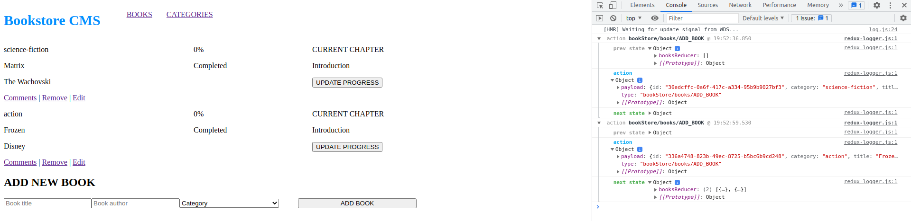

# Bookstore

> Single Page Application that lists a collection of books with information about it and its progress

The objective of this exercise was to initialize a create-react-app with re-usable components and later to set a structure folder following the 'ducks pattern' and then add React Router.

## Built With

- JavaScript/React
- React Router
- JSX
- CSS
- VSCode
- Webpack
- Babel
- Ubuntu 20.04.3
- Linters

## Setup

- Get the link of the repository: `git@github.com:arthurborgesdev/bookstore.git`
- Clone it as `git@github.com:arthurborgesdev/bookstore.git` on a Terminal

## Usage

- Run `npm install` on a Terminal to install the modules
- Run `yarn start` on a Terminal to start the server 
- Open [http://localhost:3000](http://localhost:3000) to view it in the browser.

## Author

👤 **Arthur Borges**

- GitHub: [@arthuborgesdev](https://github.com/arthurborgesdev)
- Twitter: [@arthurmoises](https://twitter.com/arthurmoises)
- LinkedIn: [Arthur Borges](https://linkedin.com/in/arthurmoises)

## 🤝 Contributing

Contributions, issues, and feature requests are welcome!

## Show your support

Give a ⭐️ if you like this project!

## Acknowledgments

- Microverse
- React and React Router documentation
- Lots and lots of Stack Overflow questions and answers